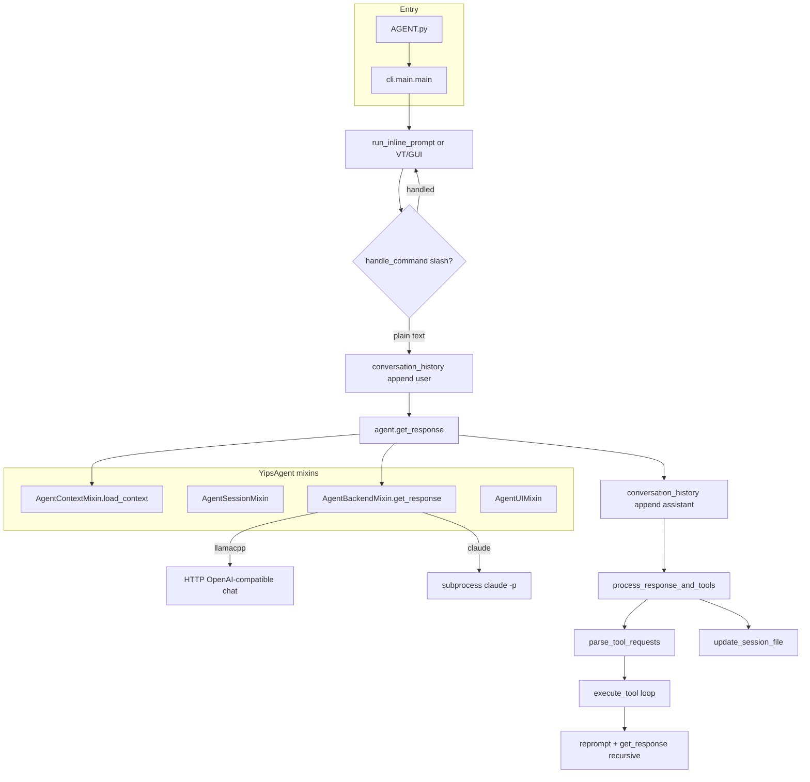

# Yips CLI — Architecture & replication blueprint

This document is a structured, implementation-faithful reference for rebuilding Yips as a new project.

**Primary sources:** [AGENT.py](../AGENT.py), [cli/main.py](../cli/main.py), [cli/agent/__init__.py](../cli/agent/__init__.py), [cli/agent/session.py](../cli/agent/session.py), [cli/agent/backend.py](../cli/agent/backend.py), [cli/agent/context.py](../cli/agent/context.py), [cli/tool_execution.py](../cli/tool_execution.py), [cli/commands.py](../cli/commands.py), [cli/completer.py](../cli/completer.py), [cli/config.py](../cli/config.py), [cli/root.py](../cli/root.py), [cli/gateway/](../cli/gateway/), [cli/setup.py](../cli/setup.py), [cli/llamacpp.py](../cli/llamacpp.py), [cli/hw_utils.py](../cli/hw_utils.py), [startup.sh](../startup.sh) / [startup.bat](../startup.bat), [scripts/setup.sh](../scripts/setup.sh) / [scripts/setup.ps1](../scripts/setup.ps1).

---

## 1. Executive summary and system purpose

### 1.1 Core operational loop (interactive CLI)

- **Boot**: `main()` in [cli/main.py](../cli/main.py) registers `atexit` for VT cleanup, parses `-c/--command`, builds `SlashCommandCompleter` + key bindings, instantiates `YipsAgent` in [cli/agent/__init__.py](../cli/agent/__init__.py), optionally clears terminal and renders title box, then runs `initialize_backend` in [cli/agent/backend.py](../cli/agent/backend.py) inside `show_booting`, HF precache, optional Discord service start.
- **Input loop**: Read line (GUI: `input()`; VT: `VTApplication`; default: `run_inline_prompt` with prompt_toolkit). Empty input continues.
- **Slash-first**: `handle_command` → `handle_slash_command` in [cli/commands.py](../cli/commands.py) runs before any model call. If handled, loop continues unless reprompt or exit.
- **Shell heuristic**: If input looks like a shell command (`SIMPLE_BASH_COMMANDS` set or `shutil.which(first_word)`), append to history, enable VT, write to PTY—no model.
- **Model turn**: Append user message → `agent.get_response` → append assistant message → `process_response_and_tools` in [cli/main.py](../cli/main.py) (ReAct-style recursion) → `update_session_file` in [cli/agent/session.py](../cli/agent/session.py).

### 1.2 Balancing slash commands vs autonomous tool usage

| Path | Mechanism | Purpose |
|------|-----------|---------|
| **Human slash** | `handle_slash_command` | Explicit `/tool` or `/skill` invocation; built-ins (`/model`, `/backend`, …); subprocess to `commands/tools|skills/<NAME>/<NAME>.py`; optional `.md` display for skills |
| **Model-driven** | `parse_tool_requests` in [cli/tool_execution.py](../cli/tool_execution.py) on assistant text | `{ACTION:…}`, `{INVOKE_SKILL:…}`, `{UPDATE_IDENTITY:…}`, `{THOUGHT:…}`, plus Claude Code-style `<|channel|>…` blocks |
| **Contract in context** | `load_context` in [cli/agent/context.py](../cli/agent/context.py) | Instructs model **not** to use slash commands; use brace syntax instead |

Autonomous depth is capped by `load_config()["max_depth"]` or `DEFAULT_MAX_DEPTH` (5) in [cli/config.py](../cli/config.py). After tools run, history gets a synthetic `user` message (`INTERNAL_REPROMPT` or error pivot) and `get_response` is called again (`process_response_and_tools` in [cli/main.py](../cli/main.py)).

---

## 2. Core architecture and execution flow

### 2.1 Lifecycle: user prompt → response (mermaid)



### 2.2 Entry points

- [AGENT.py](../AGENT.py): `from cli.main import main`; `if __name__ == "__main__": main()`.
- [cli/main.py](../cli/main.py): `python -m cli.main` (used by startup scripts).

### 2.3 `YipsAgent` composition

`YipsAgent` in [cli/agent/__init__.py](../cli/agent/__init__.py) inherits: `AgentContextMixin`, `AgentSessionMixin`, `AgentUIMixin`, `AgentBackendMixin`. It holds `conversation_history`, `archived_history`, `running_summary`, `session_state` (`thought_signature`, `error_count`, `last_action`), config-driven `backend` / `use_claude_cli` / `current_model`, resize and external-activity sentinels for prompt_toolkit.

### 2.4 Dual-backend abstraction ([cli/agent/backend.py](../cli/agent/backend.py))

| Backend key | `use_claude_cli` | `get_response` path | Notes |
|-------------|------------------|---------------------|-------|
| `llamacpp` | `False` | `call_llamacpp` / `stream_llamacpp` | POST `{base}/v1/chat/completions`; merges consecutive same-role messages; maps `system` JSON tool results to `[Observation]: …` user messages; streaming strips thinking via `clean_response` in [cli/tool_execution.py](../cli/tool_execution.py); HTTP400 context overflow triggers `force_prune_context` + retry |
| `claude` | `True` | `call_claude_cli` / `stream_claude_cli` | Builds single `full_prompt` = system + `# CONVERSATION HISTORY` + roles; subprocess `[CLAUDE_CLI_PATH, "-p", "--model", model]` with 120s timeout; optional `--verbose` |

**Initialization** (`initialize_backend`): Claude path sets `backend_initialized` immediately. Llama path calls `start_llamacpp` in [cli/llamacpp.py](../cli/llamacpp.py); on failure may prompt to `download_default_model` / `install_llama_server` in [cli/setup.py](../cli/setup.py), then fall back to Claude (`use_claude_cli = True`, `backend = "claude"`).

**Runtime fallback**: If llama response starts with `[Error: Could not connect` or `[Error calling llama.cpp`, switch to Claude and retry the same message.

### 2.5 Discord gateway and shared CLI logic

**Not a full duplicate of `process_response_and_tools`**: Discord uses `AgentRunner` in [cli/gateway/runners/base.py](../cli/gateway/runners/base.py) and **OpenAI-style `tools` / `tool_calls`** (see `LlamaCppRunner.run` in [cli/gateway/runners/llamacpp.py](../cli/gateway/runners/llamacpp.py) + [cli/gateway/tools.py](../cli/gateway/tools.py)), not `{ACTION:…}` parsing.

**Shared surfaces:**

- **Session markdown on disk**: `DiscordSessionManager.save_session` in [cli/gateway/discord_session.py](../cli/gateway/discord_session.py) writes to same `MEMORIES_DIR` from [cli/config.py](../cli/config.py) with pattern `*_discord_*.md` and extended headers (`Source`, `Platform`, `Server`, `Channel`, `ChannelId`).
- **Slash routing parity**: `handle_gateway_slash_command` in [cli/gateway/gateway_commands.py](../cli/gateway/gateway_commands.py) mirrors built-in + dynamic tool discovery order (tools then skills), subprocess env (`PYTHONPATH=PROJECT_ROOT`), 30s timeout, `::YIPS_COMMAND::` stripping—adapted for Discord (e.g. `/exit` rejected, UI-only commands return explanations).
- **Bot wiring**: `YipsDiscordBot` in [cli/gateway/discord_bot.py](../cli/gateway/discord_bot.py) → `get_runner()` selects `llamacpp` / `claude-code` / `codex`; message flow: filters → session restore → slash intercept → `asyncio.to_thread(runner.run, …)` → persist → chunk reply (1990 chars).
- **CLI integration**: [cli/main.py](../cli/main.py) calls `start_discord_service` in [cli/gateway/discord_service.py](../cli/gateway/discord_service.py) and `set_discord_activity_callback(agent.request_external_activity_refresh)` so saved Discord sessions refresh the title/status line.

[cli/gateway/gateway_ui.py](../cli/gateway/gateway_ui.py): TUI for platform tokens and gateway agent selection (separate from core agent loop).

---

## 3. Memory, state, and persistence (`.yips` and project root)

### 3.1 Path resolution

| Symbol | Definition | Role |
|--------|------------|------|
| `PROJECT_ROOT` | `find_project_root()` in [cli/root.py](../cli/root.py): `YIPS_ROOT` env → `.yips-root` → `.git` → `AGENT.py` upward → fallback `cli/` parent | Canonical repo root |
| `BASE_DIR` | `PROJECT_ROOT` in [cli/config.py](../cli/config.py) | Alias for “project” |
| `DOT_YIPS_DIR` | `BASE_DIR / ".yips"` | Session-adjacent state |
| `MEMORIES_DIR` | `DOT_YIPS_DIR / "memory"` | Markdown session files |
| `PLANS_DIR` | `DOT_YIPS_DIR / "plans"` | `{ACTION:create_plan:…}` target |
| `WORKING_ZONE` | `BASE_DIR` | `is_in_working_zone` in [cli/tool_execution.py](../cli/tool_execution.py) for autonomous file/shell guardrails |
| `CONFIG_FILE` | **`BASE_DIR / ".yips_config.json"`** (project root, not under `.yips/`) | Backend, model, verbose, streaming |
| `YIPS_ROOT` | Env override for root detection | Portable / nonstandard layouts |
| `YIPS_USER_CWD` | Set by [startup.sh](../startup.sh) / [startup.bat](../startup.bat) to directory at launch | `get_display_directory` in [cli/info_utils.py](../cli/info_utils.py) for title UI (not `load_context` working dir text—context uses `BASE_DIR`) |
| `YIPS_PERSIST_BACKEND` | Set to `1` in startup scripts | **Not read** by Python in traced code (reserved/legacy per [docs/DEVELOPER.md](DEVELOPER.md)) |

### 3.2 `update_session_file` / `load_session` ([cli/agent/session.py](../cli/agent/session.py))

**Write (`update_session_file`):**

- First call: `session_created = True`, filename `{timestamp}_{slug}.md` where `slug = generate_session_name_from_message()` (first user message, lowercased, alnum + underscores, max 50).
- Body structure: `# Session Memory` + metadata lines + `## Conversation` with optional `### Running Summary`, `### Archived Conversation`, `### Active Conversation`.
- Lines: `**Katherine**:` / `**Yips**:` / `*[System: preview]*` (system preview truncated via `_format_system_preview`).
- Footer: `---` + `*Last updated: …*`.

**Read (`load_session`):**

- Requires `## Conversation` in file.
- State machine over sections: `summary` → `archived` → `active` (default `active` if no headers).
- Parses `**Katherine**:` → `user`, `**Yips**:` → `assistant`, `*[System:` → `system` (content from slice `[9:-2]`—assumes closing `]*`).
- Continuation lines append to last message in current list.
- Sets `session_file_path`, `session_created`, `current_session_name` (from stem split `_` ×3), `calculate_context_limits()`, `refresh_display()`.

**Caveat:** `clean_response` in [cli/tool_execution.py](../cli/tool_execution.py) strips leaked `# Session Memory` / `**Katherine**:` patterns from *model* output—orthogonal to file format.

### 3.3 `.yips/` artifacts (mutations)

| Artifact | Written by | Read by |
|----------|------------|---------|
| `memory/*.md` | `update_session_file`, `DiscordSessionManager.save_session`, rename via `::YIPS_COMMAND::RENAME::` / `rename_session` | `load_session`, `load_context` (recent 5, excluding current), `info_utils` activity |
| `plans/*.md` | `execute_tool` `create_plan` | (user / external) |
| `FOCUS.md` | [commands/tools/FOCUS/FOCUS.py](../commands/tools/FOCUS/FOCUS.py) | `load_context` → `# CURRENT FOCUS AREA` |
| `preferences.json` | User / external | `calculate_context_limits` (`max_context_tokens`), `load_context` (`# USER PREFERENCES`) |
| `metrics.json` | Not auto-created by app | [cli/main.py](../cli/main.py) increments if file exists: `total_actions`, `successes` after tools; `user_interventions` on each non-slash user message |
| Project root `IDENTITY.md` | `execute_tool` `{UPDATE_IDENTITY:…}` appends dated `### [date] Reflection` | `load_context` `# IDENTITY` |
| Project root `AGENT.md` | User | `load_context` `# SOUL DOCUMENT` |
| `author/HUMAN.md` | User | `load_context` `# ABOUT KATHERINE`, `get_username` |

**Context pruning:** `force_prune_context` in [cli/agent/backend.py](../cli/agent/backend.py) preserves first user message; pops or truncates older messages into `archived_history`; thresholds from `token_limits` (RAM-based or `preferences.json`).

---

## 4. Plugin system and tool execution (contract)

### 4.1 Discovery and precedence

| Layer | Location | Precedence |
|-------|----------|------------|
| Built-in slash | `handle_slash_command` | Hard-coded branches first |
| Dynamic commands | `TOOLS_DIR` then `SKILLS_DIR` in [cli/config.py](../cli/config.py) | **Tools win**: `next(... TOOLS_DIR …)` then skills ([cli/commands.py](../cli/commands.py) ~388–394) |
| Completer | `SlashCommandCompleter._get_words_and_meta` in [cli/completer.py](../cli/completer.py) | Iterates `[TOOLS_DIR, SKILLS_DIR]`; later directory can overwrite `all_items[cmd_name]` if both exist—skills can refine metadata when names collide |
| Per-invocation behavior | Same directory | If both `.md` and `.py` exist: show `.md` (gradient print) then run `.py` |

### 4.2 Execution environment (host subprocess)

- **Python:** Prefer `PROJECT_ROOT/.venv/Scripts/python.exe` (Windows) or `.venv/bin/python3` (else); else `sys.executable`.
- **Environment:** `PYTHONPATH=str(PROJECT_ROOT)`.
- **Timeout:** **30s** for normal tools/skills (`subprocess.run`); **VT skill:** no capture, no timeout, interactive (`execute_tool` in [cli/tool_execution.py](../cli/tool_execution.py)).
- **Platform:** `run_command` uses `shell=True`, 60s timeout; `ls`/`grep` branch on `os.name == 'nt'` (`dir` / `findstr` vs `ls` / `grep`).

### 4.3 Stdout control protocol (`::YIPS_COMMAND::`)

| Pattern | Regex | Emitters (examples) | Handler behavior |
|---------|-------|---------------------|------------------|
| `::YIPS_COMMAND::NAME::ARGS` | `r'::YIPS_COMMAND::(\w+)::(.*)'` | [EXIT.py](../commands/tools/EXIT/EXIT.py), [RENAME.py](../commands/tools/RENAME/RENAME.py), [REPROMPT.py](../commands/tools/REPROMPT/REPROMPT.py) | **CLI** [cli/commands.py](../cli/commands.py): `RENAME` → `agent.rename_session`; `EXIT` → `graceful_exit` + `"exit"`; `REPROMPT` → return `::YIPS_REPROMPT::…` to main loop. **Autonomous skills** [cli/tool_execution.py](../cli/tool_execution.py): same + `::YIPS_EXIT::` return exits process; `REPROMPT` returns string consumed by `process_response_and_tools`. **Discord** [cli/gateway/gateway_commands.py](../cli/gateway/gateway_commands.py): `EXIT` stripped/rejected; `REPROMPT` → `::GATEWAY_REPROMPT::`; `RENAME` calls `session_mgr.rename_session` **only if** that method exists (not present on current `DiscordSessionManager`—effectively no-op unless extended). |

---

## 5. Autonomous agent logic and parsing

### 5.1 `parse_tool_requests` ([cli/tool_execution.py](../cli/tool_execution.py))

1. **Mask code fences:** `re.sub(r"```.*?```", …, DOTALL)` so examples inside triple backticks are not parsed.
2. **`{ACTION:tool:params}`:** `r"\{ACTION:\s*(\w+)\s*:\s*([^}]*)\}"` → `type: action`.
3. **Claude Code-style:** `r"<\|channel\|>.*?to=([a-zA-Z0-9_\.]+)[\s\S]*?<\|message\|>(\{.*?\})"` → `json.loads` on message; maps channels to `run_command`, `write_file`, `read_file`, `ls`, `grep`, `git`, or `SEARCH` skill from `query`/`q`; fallback `run_command` if `command` key exists.
4. **`{UPDATE_IDENTITY:…}`:** `r"\{UPDATE_IDENTITY:([^}]*)\}"` → `type: identity`.
5. **`{INVOKE_SKILL:NAME:args}`:** `r"\{INVOKE_SKILL:\s*(\w+)\s*(?::\s*([^}]*))?\}"` → `type: skill`; args optional.
6. **`{THOUGHT:…}`:** `r"\{THOUGHT:([^}]*)\}"` → `type: thought` (updates `session_state["thought_signature"]`, no `execute_tool`).
7. **Dedup:** consecutive identical requests removed via `key = str(sorted(req.items()))`.

### 5.2 `execute_tool` action schema (built-in)

| `tool` | `params` format | Behavior summary |
|--------|-----------------|------------------|
| `read_file` | path | `read_text`; confirm if outside `WORKING_ZONE` |
| `write_file` | `path:content` (first `:` split) | mkdir; diff preview for existing; confirm new file |
| `run_command` | shell command | `DESTRUCTIVE_PATTERNS` guard; cwd heuristic confirm; **60s** timeout |
| `ls` | path (default `.`) | `dir` vs `ls -F1`; **10s** |
| `grep` | `pattern:path` | `findstr` vs `grep -rnI`; **30s** |
| `git` | subcommand | `cwd=PROJECT_ROOT`; **30s** |
| `sed` | `expression:path` | **Rejected on Windows** |
| `edit_file` | `path:::old:::new` | unique replace; diff confirm |
| `create_plan` | `name:content` | writes `PLANS_DIR/name.md` |
| *(unknown)* | — | `[Unknown tool: …]` |

**Identity:** appends to `BASE_DIR/IDENTITY.md`.

**Skill:** uppercases name; resolves `SKILLS_DIR/NAME/NAME.py` then `TOOLS_DIR/NAME/NAME.py`; `SEARCH` + args `query` literal blocked; parses `::YIPS_COMMAND::` in stdout.

### 5.3 `clean_response` (display pipeline)

- Removes: action/identity/skill/thought tags; partial `<|channel|>` / `<|constrain|>` / `<|message|>` / generic `<|.*?|>`; incomplete trailing `{ACTION:…` without `}`.
- Strips session-memory-shaped blocks and cuts at markers like `\n# Session Memory`, `\n**Katherine**:`, etc.
- If whole body is JSON object only → `""`.
- Strips `<think>…</think>` and unclosed thinking.
- Normalizes newlines; `_restore_utf8` (latin-1→utf-8 repair); `_strip_non_ascii`; `_strip_internal_plan_blocks` (regex removes early trivial `def main` + only-`print` python fences in first 400 chars).
- Special: `{ACTION:write_file:` + code in response may suppress fenced code in display.

---

## 6. Setup, environment, and hardware operations

### 6.1 Startup wrappers

- **[startup.sh](../startup.sh):** `cd` script dir → `./scripts/setup.sh` → `exec ./.venv/bin/python3 -m cli.main "$@"` with `YIPS_PERSIST_BACKEND=1`, `YIPS_USER_CWD=$(pwd)`.
- **[startup.bat](../startup.bat):** `scripts\setup.ps1` → `.venv\Scripts\python.exe -m cli.main %*` with same env vars.

### 6.2 `scripts/setup.sh` (Unix) — behavioral highlights

- Resolves `PROJECT_ROOT`, creates `.venv`, installs deps, optionally clones/builds `~/llama.cpp` with `-DLLAMA_BUILD_SERVER=ON` and `-DGGML_CUDA=ON/OFF`, uses `detect_cuda_toolkit`-style probes via embedded Python, symlinks `llama-server` to `~/.local/bin`, may link `yips` launcher (see full script).

### 6.3 `scripts/setup.ps1` (Windows) — behavioral highlights

- Ensures Python, creates venv, `Ensure-Cmake`: venv Scripts on PATH, pip `cmake>=3.20`, optional `winget install Kitware.CMake`.
- Aligns with [cli/setup.py](../cli/setup.py) patterns for MSVC (no g++ check on Windows).

### 6.4 `cli/setup.py` — llama.cpp lifecycle

- **`install_llama_server`:** Target `~/llama.cpp`; `git pull` or `git clone`; Windows + NVIDIA: try `_download_prebuilt_llama_cuda` from GitHub releases before source build; **`check_build_tools`:** Windows may `pip install cmake`, prepend `.venv\Scripts` to PATH; Unix requires `g++` or `clang++`; **`has_nvidia_gpu` + no CUDA toolkit** → error (no CPU-only escape when GPU present); **`get_llama_cmake_args`:** `-DLLAMA_BUILD_SERVER=ON`, `-DGGML_CUDA=ON/OFF`, optional `-DCUDAToolkit_ROOT`; build `llama-server` Release.
- **`download_default_model`:** If missing, parse `LLAMA_DEFAULT_MODEL` `org/repo/file` → HuggingFace `resolve/main` URL → stream to `~/.yips/models/...`.

### 6.5 `cli/hw_utils.py` — CUDA and specs

- **`get_system_specs`:** `psutil` RAM; `nvidia-smi` VRAM sum; optional `rocm-smi` AMD flag.
- **`detect_cuda_toolkit`:** PATH `nvcc`, then Windows `C:\Program Files\NVIDIA GPU Computing Toolkit\CUDA\v*` (descending) or Unix `/usr/local/cuda`, `/opt/cuda`; compares nvcc version to driver max from `nvidia-smi` “CUDA Version: X.Y”.
- **`detect_cuda_support`:** Requires GPU via `nvidia-smi`; if toolkit missing but GPU present, still returns `available: True` with reason “NVIDIA GPU detected via nvidia-smi” (runtime CUDA for prebuilt binaries).

### 6.6 `cli/llamacpp.py` — runtime

- **Binary resolution:** `LLAMA_SERVER_PATH` env, then `~/llama.cpp/build/bin/Release|…`, `which llama-server`.
- **Models dir:** `~/.yips/models`; default model constant in module.
- **`start_llamacpp`:** Resolve GGUF path; port collision → `_find_available_port`; strategies GPU (`-ngl 999`) → hybrid → CPU if CUDA build; else CPU only; subprocess with stderr log file; Windows `CREATE_NEW_PROCESS_GROUP`, Unix `start_new_session`; health poll up to 60s.
- **`stop_llamacpp`:** terminate Popen; `taskkill` / `pkill`; aggressive kill if needed.
- **`get_optimal_context_size`:** `(ram_gb + vram_gb) * 512`, round down to 1024, min 2048.
